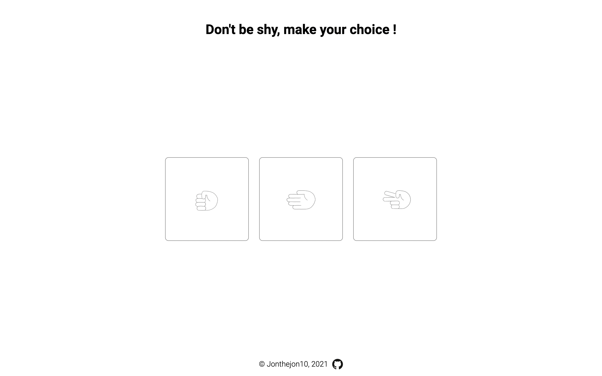

# Rock-paper-scissors project

## Made with Javascript, HTML and CSS.

By completing this project I learned a bit about loops, how to develop different scenarios based on input and how to use the random method, amongst other things.
I really struggled with loops and trying to make it so it has 5 rounds and displays win/loss messages, but in the end it was really satisfactory and I enjoyed the journey.

<a href="https://ionutianchis.github.io/rock-paper-scissors/">Live preview</a>

